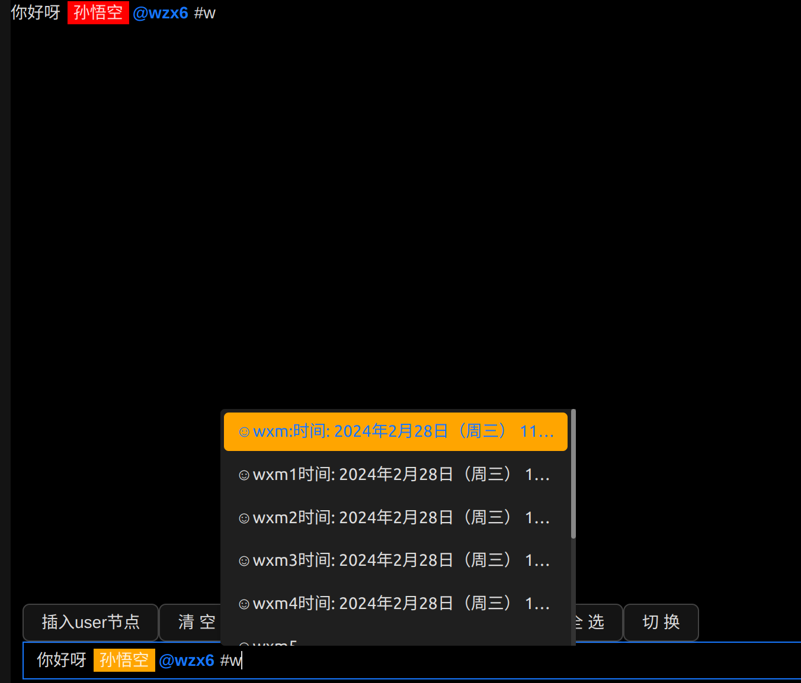

# react-comment-input 使用指南

`react-comment-input` 是一个类似飞书输入框的 React的输入组件，用于显示欢迎消息。

## 自定义组件
先定义一个自定义组件的数据格式
```ts
interface UserElement {
  type:'user',
  username:string
  children: [{ text: any }]
}

/**
 * type和children属性是固定的,children是个数组里面可嵌套，但是必须要有个，
 * 一般 {text:""}默认
 */
const userNode: UserElement = {
  type: 'user',
  username: 'wzx',
  children: [{ text: 'wzx' }]
}
```
再定一个UserNode的自定义组件用于在输入框中显示
```tsx
import { FC } from 'react'
import { RenderElementProps } from '@unreal/react-comment-input/lib/types/types'
const UserNode: FC<RenderElementProps> = (props) => {
  /**
   * 这里的children就是UserElement的children
   */
  const { attributes, element, children } = props
  const el: { username: string } = element as UserElement
  return (
    <span
      {...attributes}
      contentEditable={false}
      style={{ padding: '2px 5px', margin: '0 2px', background: 'orange' }}
    >
      {el.username}
      {children}
    </span>
  )
}
export default UserNode
```
接着在ReactCommentInput传入一些属性
1. `extendRenderElement`这里必须传入对应的类型，以及该类型需要渲染的组件（照我的就可以）
2. `htmlToSlateConfigOptions`将html转成编辑器的数据格式比如`<user user-data="batman"></user>`,当编辑器遇到这个html的时候会解析他，这边我是做了判断如果在`<user>`这个标签上有`user-data`属性则说明是我自定义的属性，否则就使普通的类型，这边都可以自己去写逻辑
3. `slateToDomConfigOptions`将编辑器的数据格式转成html 
`elementAttributeTransform` 这个属性是用来将自定的数据格式通过这个方法转成html的数据。
`elementMap` 这个属性是用来将自定的数据格式的`type`转化为对应的html的标签这边我转为了`<user></user>`标签
4. `isInlineElementTypes`用来标记是行内元素
5. `isVoidElementTypes`"void"节点是 Slate 中的一个特殊概念，表示一个不能被编辑或只能以特殊方式编辑的节点。例如，你可能希望在编辑器中插入一个图像，这个图像是一个节点，但用户不能像编辑文本那样编辑它——它是一个"void"节
6. `theme`目前支持`dark|light`两种，对应的是`mention`的弹窗样式
```tsx
  <ReactCommentInput
    theme="dark"
    renderElementConfig={{
      extendRenderElement: [
        {
          type: 'user',
          renderElement: ({ children, ...rest }) => {
            return <UserNode {...rest}>{children}</UserNode>
          }
        }
      ],
    }}
    htmlToSlateConfigOptions={{
      elementTags: {
        user: (_el) => {
          if (_el) {
            const { attribs } = _el
            if (attribs['user-data']) {
              return {
                type: 'user',
                username: attribs['user-data']
              }
            }
          }
          return {
            type: 'span'
          }
        }
      }
    }}
    slateToDomConfigOptions={{
      elementAttributeTransform: ({ node, attrs }) => {
        if (node.type === 'user') {
          attrs['user-data'] = node.username
        }
        return attrs
      },
      elementMap: {
        user: 'user'
      }
    }}
  />
```
懒得写了，反正目前只有我在开发哈哈
```tsx
const CommentPage: FC = () => {
  const ref = useRef<ReactCommentInputRef>(null)
  const [value, setValue] = useState<string>()
  const getOptions = async (words: string) => {
    await delay(2000)
    return [
      { label: 'wzx', value: 'wzx', extra: 19 },
      { label: 'wzx6', value: 'wzx6' },
      { label: 'wzx2', value: '1wzx2', disabled: true },
      { label: 'wzx112', value: '1wzx122', disabled: true },
      { label: 'wzx3', value: '2wzx3' }
    ].filter((item) => item.label.toLowerCase().startsWith(words.toLowerCase()))
  }
  return (
    <Box $isFull={true} $position={'relative'} $flex={true} $flexDirection={'column'}>
      <div style={{ flexGrow: 1, overflow: 'auto' }}>
        xxx
        <div style={{ height: 2000 }}>aaa</div>
      </div>
      <div style={{ padding: 10 }}>
        <Button
          onClick={() => {
            if (ref.current) {
              const { editor, Transforms, ReactEditor } = ref.current
              ReactEditor.focus(editor)
              const userNode: any = {
                type: 'user',
                username: 'wzx',
                children: [{ text: 'wzx' }]
              }
              Transforms.insertFragment(editor, [userNode])
              Transforms.move(editor, { distance: 1 })
              editor.normalize()
            }
          }}
        >
          插入自定义节点
        </Button>
        <Button
          onClick={() => {
            if (ref.current) {
              const {
                actions: { clear }
              } = ref.current
              clear()
            }
          }}
        >
          清空
        </Button>
        <Button
          onClick={() => {
            if (ref.current) {
              const {
                actions: { clearHistory }
              } = ref.current
              clearHistory()
            }
          }}
        >
          清空历史
        </Button>
        <Button
          onClick={() => {
            if (ref.current) {
              const {
                actions: { focus }
              } = ref.current
              focus('start')
            }
          }}
        >
          聚焦开始
        </Button>
        <Button
          onClick={() => {
            if (ref.current) {
              const {
                actions: { focus }
              } = ref.current
              focus('end')
            }
          }}
        >
          聚焦结束
        </Button>
        <Button
          onClick={() => {
            if (ref.current) {
              const {
                editor,
                ReactEditor,
                actions: { selectedAll }
              } = ref.current
              ReactEditor.focus(editor)
              selectedAll()
            }
          }}
        >
          全选
        </Button>
        <ReactCommentInput
          ref={ref}
          theme="dark"
          mentions={[
            {
              trigger: '@',
              filterKeys: ['label', 'value'],
              options: [
                { label: 'wzx', value: 'wzx', extra: 19 },
                { label: 'wzx6', value: 'wzx6' },
                { label: 'wzx2', value: '1wzx2', disabled: true },
                { label: 'wzx112', value: '1wzx122', disabled: true },
                { label: 'wzx3', value: '2wzx3' }
                // { label: 'wzx4', value: '3wzx4', disabled: true }
              ],
              customElement: (option) => {
                if (option.value === 'wzx') {
                  return {
                    type: 'user',
                    username: option.value,
                    children: [{ text: option.label }]
                  }
                }
                return
              }
            },
            {
              trigger: '!',
              filterKeys: ['label', 'value'],
              options: async (words) => {
                const data = await getOptions(words)
                return data
              },
              customElement: (option) => {
                if (option.value === 'wzx') {
                  return {
                    type: 'user',
                    username: option.value,
                    children: [{ text: option.label }]
                  }
                }
                return
              }
            },
            {
              trigger: '#',
              eclipse: true,
              options: [
                {
                  label:
                    'wxm:时间: 2024年2月28日（周三） 11:00 - 12:00 (GMT+8)wxm:时间: 2024年2月28日（周三） 11:00 - 12:00 (GMT+8)wxm:时间: 2024年2月28日（周三） 11:00 - 12:00 (GMT+8)wxm:时间: 2024年2月28日（周三） 11:00 - 12:00 (GMT+8)',
                  value: 'wxm'
                },
                { label: 'wxm1时间: 2024年2月28日（周三） 11:00 - 12:00 (GMT+8)', value: 'wxm1' },
                { label: 'wxm2时间: 2024年2月28日（周三） 11:00 - 12:00 (GMT+8)', value: 'wxm2' },
                { label: 'wxm3时间: 2024年2月28日（周三） 11:00 - 12:00 (GMT+8)', value: 'wxm3' },
                { label: 'wxm4时间: 2024年2月28日（周三） 11:00 - 12:00 (GMT+8)', value: 'wxm4' },
                { label: 'wxm5', value: 'wxm5' },
                { label: 'wxm6时间: 2024年2月28日（周三） 11:00 - 12:00 (GMT+8)', value: 'wxm6' },
                { label: 'wxm7', value: 'wxm7' },
                { label: 'wxm8时间: 2024年2月28日（周三） 11:00 - 12:00 (GMT+8)', value: 'wxm8' },
                { label: 'wxm9', value: 'wxm9' }
              ],
              customMentionItem: (option, attributes, data, actions) => {
                return (
                  <div
                    data-mention-index={attributes['data-mention-index']}
                    key={option.value}
                    onClick={actions.onClick}
                    className={attributes.className}
                    style={{ background: data.isSelected ? 'orange' : '' }}
                  >
                    ☺{option.label}
                  </div>
                )
              }
            }
          ]}
          mentionContainer={{
            style: { maxWidth: 300 },
            customLoading: <div>加载中...</div>
          }}
          renderElementConfig={{
            extendRenderElement: [
              {
                type: 'user',
                renderElement: ({ children, ...rest }) => {
                  return <UserNode {...rest}>{children}</UserNode>
                }
              }
            ]
          }}
          htmlToSlateConfigOptions={{
            elementTags: {
              user: (_el) => {
                if (_el) {
                  const { attribs } = _el
                  if (attribs['user-data']) {
                    return {
                      type: 'user',
                      username: attribs['user-data']
                    }
                  }
                }
                return {
                  type: 'span'
                }
              }
            }
          }}
          slateToDomConfigOptions={{
            elementAttributeTransform: ({ node, attrs }) => {
              if (node.type === 'user') {
                attrs['user-data'] = node.username
              }
              return attrs
            },
            elementMap: {
              user: 'user'
            }
          }}
          isInlineElementTypes={['user']}
          isVoidElementTypes={['user']}
          value={value}
          onChange={(v) => {
            console.log(v)
            setValue(v)
          }}
          placeholder={'说点什么'}
        />
      </div>
    </Box>
  )
}
```


## store 本组件提供配置存储 `useReactCommentInputStore`
使用方法
```tsx
import { useReactCommentInputStore } from '@unreal/react-comment-input'
```
在预览组件`<PreviewEditor/>`和编辑组件`<ReactCommentInput />` 里面有一些通用的配置
```tsx
    const commonConfig:PreviewEditorProps = {
      isInlineElementTypes,
      isVoidElementTypes,
      isMarkableVoidElementTypes,
      value,
      className,
      style,
      htmlToSlateConfigOptions,
      slateToDomConfigOptions,
      renderElementConfig,
    }
    //你可以
  <PreviewEditor {...commonConfig} {..._others} />
  <ReactCommentInput {...commonConfig} {...others} />
  //也可以
    useEffect(() => {
      useReactCommentInputStore.setState({
        basicProps: commonConfig
      })
    }, [commonConfig])
   const basicProps=useReactCommentInputStore(state=>state.basicProps)
    if (basicProps){
      //这边需要设置完再加载，因为editor初始化的时候需要把一些参数一起配置了这样才能保证自定义组件正确
      //的渲染出来
      return (
        <>
          <PreviewEditor  {..._others} />
          <ReactCommentInput {...others} />
        </>
      )
    }
```

## tips
### 当前的 `<ReactCommentInput />`  是非受控模式，如果要更新里面的值请使用 `ref?.actions.updateValye(html)` 这个方法
